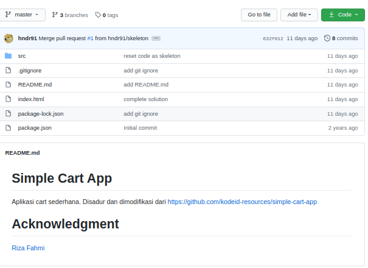
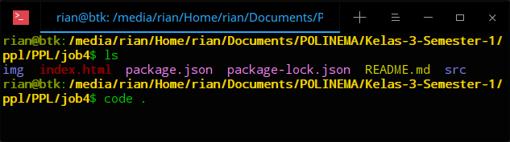
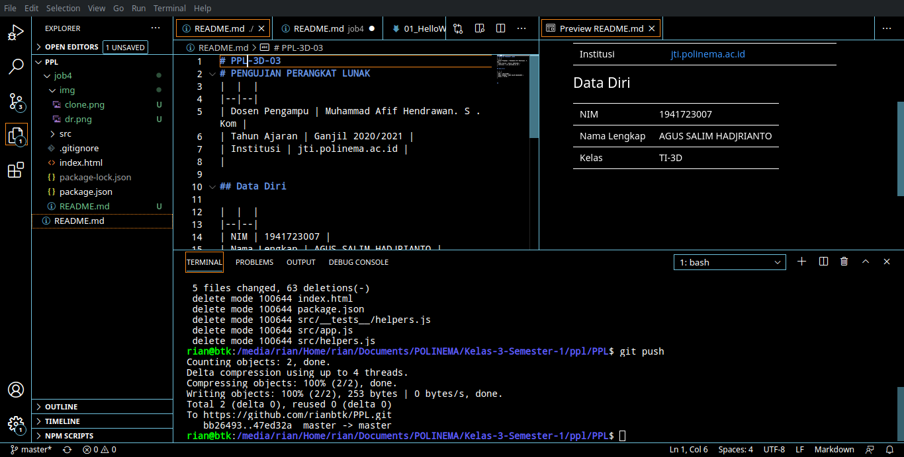
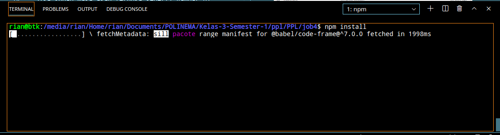
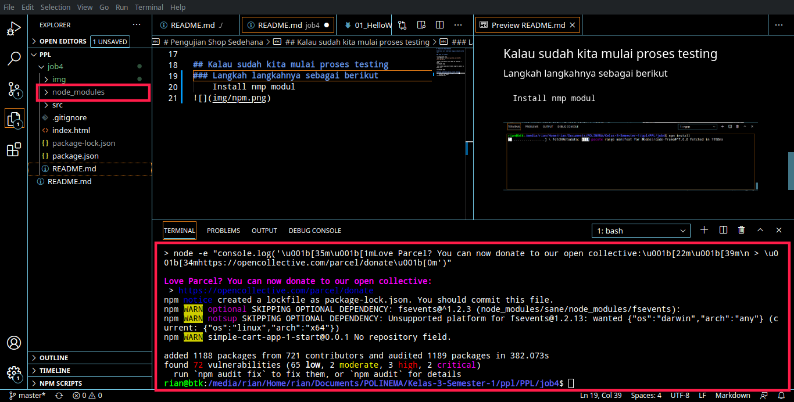
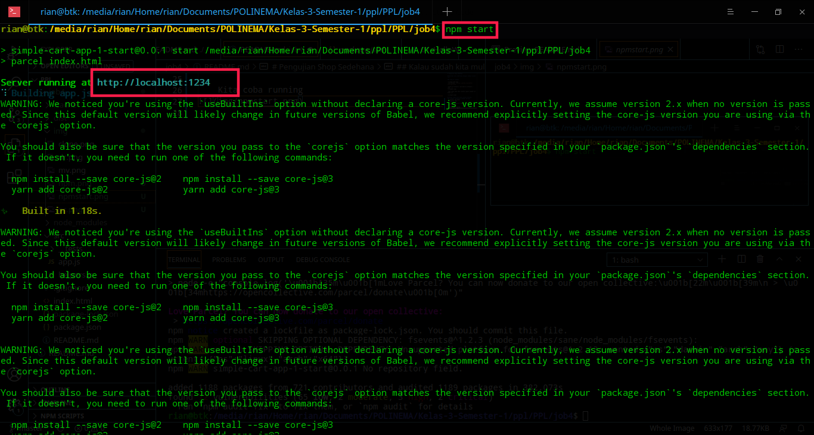
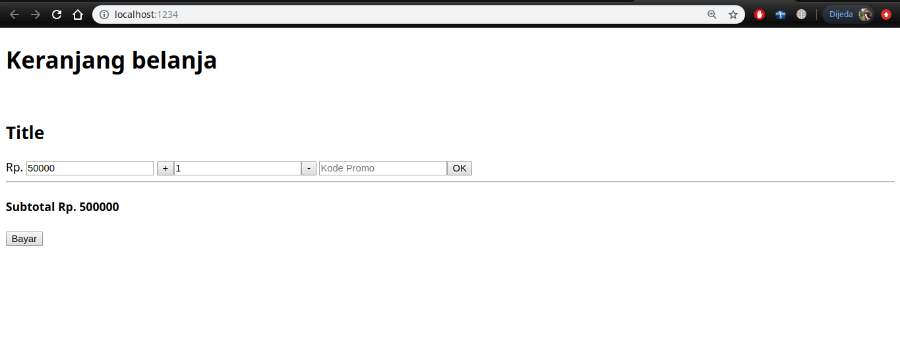

# Pengujian Shop Sedehana

## Berikut cara sederhana menguji sebuah sistem
 

### Yang di siapkan

`Link Github ` [https://github.com/hndr91/kuis1-ppl.git]

`Clone di direktori lalu buka di terminal | code . |`

`Jika sudah maka akan terbuka seperti gambar di bawah ini `

## Kalau sudah kita mulai proses testing
### Langkah langkahnya sebagai berikut
    Install nmp modul

    Maka akan muncull modul node_modules

    Kita coba running

Setelah kita running kita buka
[http://localhost:1234/] maka akan keluar tampilan sebagai berikut

### Permasalahan

**Bug yang ditemukan:**

- [x] Bug pada button **+**
- [x] Bug pada button **-**
- [x] Bug pada button **Ok**
- [x] Bug pada button **Bayar**
- [x] Bug pada qtt **+**
- [x] BUg pada qtt **-**
- [x] Bug pada **Subtotal**

** Penyelesaian BUg **

