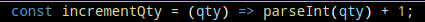
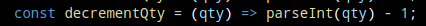
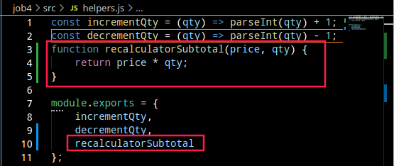
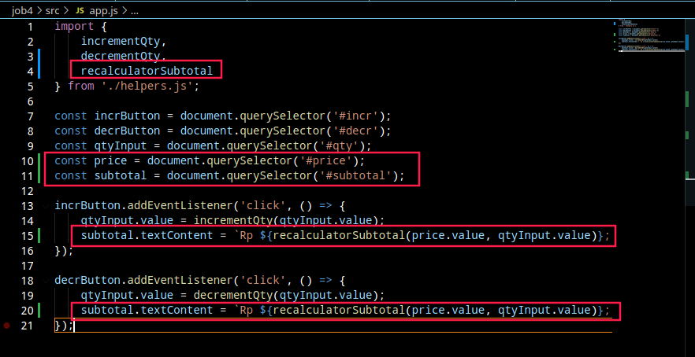
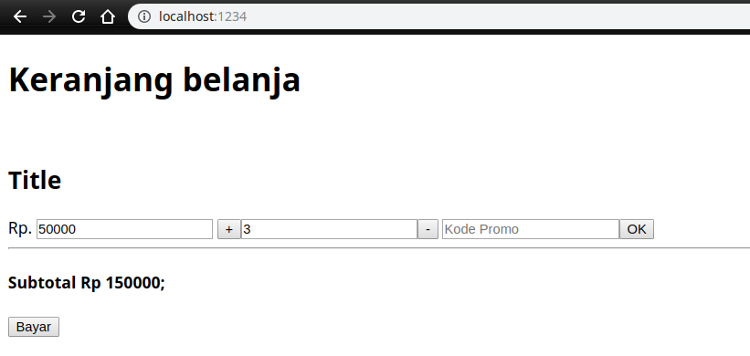
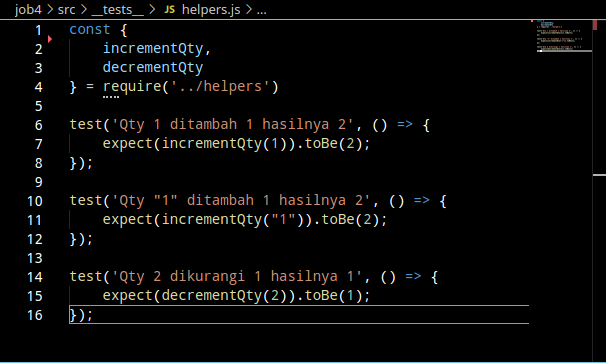
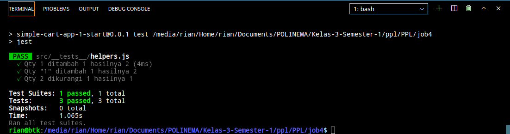
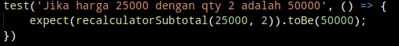
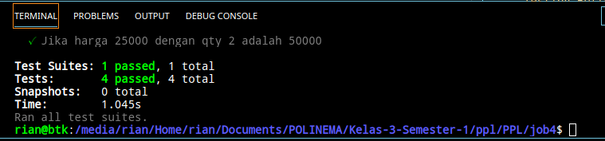

# Pengujian Shop Sedehana

## Berikut cara sederhana menguji sebuah sistem
 

### Yang di siapkan

 

`Link Github ` [https://github.com/hndr91/kuis1-ppl.git]

`Clone di direktori lalu buka di terminal | code . |`

`Jika sudah maka akan terbuka seperti gambar di bawah ini `

## Kalau sudah kita mulai proses testing
### Langkah langkahnya sebagai berikut
    
`Install nmp modul`

`Maka akan muncull modul node_modules`

`Kita coba running`

`Setelah kita running kita buka
[http://localhost:1234/] maka akan keluar tampilan sebagai berikut`

### Permasalahan

**Bug yang ditemukan:**

- [ ] Bug pada button **+**
- [ ] Bug pada button **-**
- [ ] Bug pada button **Ok**
- [ ] Bug pada button **Bayar**
- [ ] Bug pada **Subtotal**

**Penyelesaian Bug**

- [x] Bug pada button **+**

    `Pertama kita ubah dulu logic dari code yang ada di helpers sepeti gambar di bawah ini`

- [x] Bug pada button **-**

    `Pertama kita ubah dulu logic dari code yang ada di helpers sepeti gambar di bawah ini`

- [x] Bug pada button **Ok**
- [x] Bug pada button **Bayar**
- [x] Bug pada **Subtotal**

    `Setelah kita tahu bahwa button + dan - seharusnya ketika di klik seharusnya harga juga ikut berubah, maka setelah kita tau logicnya maka langsung saja kita ubah di source code nya seperti d bawah ini`

    `Hasil`

 

### Testing NPM

`Testing Logic Plus & Minus yang di Parse (Dipaksa menjadi integer)`

`Testing Button Plus & Minus ke Harga`

